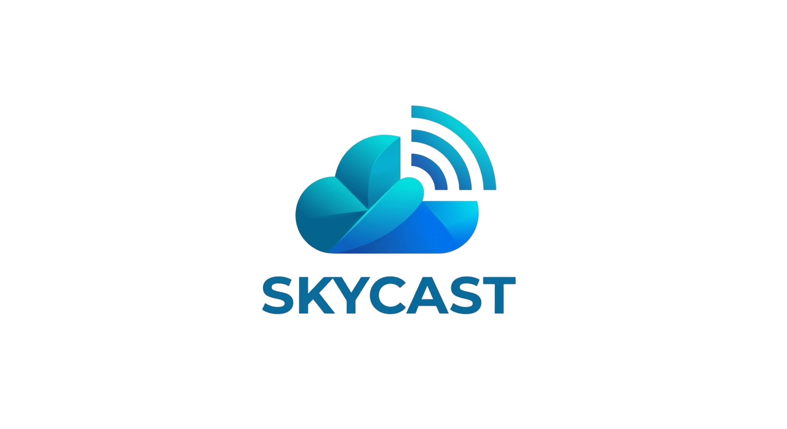

<p align="center" style="margin-bottom: 0px;">
  
</p>

<h1 align="center" style="margin-top: -30px; color: white;">🌧️ SkyCast - Sistema Integral de Gestión de Alertas Municipales</h1>

<p align="center">
  Una plataforma robusta para la monitorización climática urbana y la emisión proactiva de alertas de seguridad ciudadana.
</p>

<p align="center">
  
  
  
  
  
</p>

---

## ✨ Introducción a SkyCast

**SkyCast** es una solución integral y fiable diseñada para la monitorización climática y la gestión de riesgos en entornos urbanos. Desarrollado en Python, este sistema robusto permite a las administraciones municipales procesar datos ambientales en tiempo real, generar alertas precisas y proporcionar información valiosa para la toma de decisiones. Su objetivo principal es mejorar la seguridad ciudadana y optimizar la gestión de recursos frente a fenómenos meteorológicos adversos.

---

## 🚀 Funcionalidades Principales

SkyCast ofrece un conjunto de características clave para una gestión climática municipal eficiente:

-   **Monitorización Climática en Tiempo Real:** Captura y procesamiento continuo de datos ambientales como temperatura, humedad y velocidad del viento.
-   **Sistema de Alertas Inteligente:** Detección automática y priorizada de situaciones de riesgo crítico (ej. calor extremo, heladas, rachas de viento peligrosas, humedad extrema). La lógica de exclusión en `alertas.py` garantiza que solo se emita la alerta más relevante por categoría.
-   **Gestión de Datos Robusta:** Persistencia segura y eficiente de los registros climáticos en formato CSV, con control de duplicados y manejo de errores de permisos.
-   **Análisis y Estadísticas Avanzadas:** Generación de informes estadísticos detallados por zona geográfica, proporcionando insights valiosos para la planificación.
-   **Control de Acceso Seguro:** Sistema de autenticación de usuarios para garantizar la integridad y privacidad del sistema.
-   **Interfaz de Usuario Dual:** Acceso a través de una interfaz de línea de comandos (CLI) y una moderna Interfaz de Visualización Dinámica basada en web.

---

## 🛠️ Arquitectura del Sistema

El proyecto SkyCast se adhiere al principio de **Responsabilidad Única**, estructurando el código en módulos independientes para facilitar el mantenimiento, la escalabilidad y la comprensión.

### Componentes del Backend (Core Lógico)

-   **`main.py`**: Punto de entrada principal y orquestador del flujo de la aplicación CLI.
-   **`registro.py`**: Módulo encargado de la captura de datos climáticos desde la entrada del usuario.
-   **`validacion.py`**: Motor de reglas que asegura la calidad e integridad de los datos, validando formatos y rangos.
-   **`alertas.py`**: Módulo central que evalúa los datos climáticos contra umbrales predefinidos para generar alertas de seguridad. Su lógica de exclusión garantiza la emisión de la alerta más severa.
-   **`datos_csv.py`**: Implementado con la clase `GestorDatosClima`, esta capa de abstracción gestiona la persistencia y consulta de datos en el archivo CSV, encapsulando la lógica de acceso a datos.
-   **`auth.py`**: Módulo de autenticación y gestión de usuarios, garantizando un control de acceso seguro al sistema.

### Interfaz de Visualización Dinámica (Aplicación Web)

La aplicación web de SkyCast actúa como una **Interfaz de Visualización Dinámica**, integrando el core lógico del backend para ofrecer dashboards interactivos. Esta capa permite una gestión visual intuitiva de la casuística climática, presentando datos y alertas de manera accesible sin depender de una tecnología de frontend fija, lo que facilita su evolución y adaptación futura.

---

##  Pilares Técnicos y de Calidad

SkyCast se construye sobre una base sólida de excelencia técnica, seguridad y calidad de software:

### A. Seguridad y Control de Acceso
-   **Hashing SHA-256 en `auth.py`**: Las credenciales de usuario son protegidas mediante el algoritmo de hashing SHA-256, asegurando que las contraseñas nunca se almacenen en texto plano. Esto garantiza la integridad y confidencialidad de la información sensible.
-   **Módulo `auth.py`**: Proporciona una gestión centralizada de registros e inicios de sesión, incluyendo un prototipo de integración con OAuth para futuras expansiones.
-   **Privacidad en Consola**: El uso de `getpass` asegura que las credenciales sean invisibles durante la entrada en la interfaz de línea de comandos.

### B. Calidad de Software y Testing
-   **Tests Unitarios con `pytest`**: La suite de pruebas automatizadas en la carpeta `/tests` garantiza la fiabilidad del sistema. Esto incluye la validación de la lógica de exclusión de alertas en `alertas.py`, asegurando que los cambios no introduzcan regresiones y que los umbrales críticos funcionen como se espera.
-   **Integración Continua**: Las pruebas automatizadas son un pilar para mantener la estabilidad del sistema a medida que evoluciona.

### C. Análisis de Datos Avanzado
-   **Integración de `pandas`**: La librería líder en ciencia de datos se utiliza para el procesamiento y análisis eficiente de grandes volúmenes de datos climáticos.
-   **`GestorDatosClima`**: La implementación orientada a objetos en `datos_csv.py` centraliza el manejo del dataset, permitiendo generar resúmenes estadísticos automáticos por zona que incluyen medias de temperatura y humedad, máximos de viento y conteo de registros. Esto asegura la integridad de los datos y proporciona insights valiosos.
-   **Robustez de Procesamiento**: Implementación de filtros de limpieza de datos y manejo de excepciones para garantizar la estabilidad de la aplicación incluso con datos inconsistentes.

---

## 🖥️ Interfaz de Visualización Dinámica (Web)

La aplicación web de SkyCast ofrece una experiencia de usuario intuitiva para la visualización de datos climáticos y la gestión de alertas. A través de dashboards interactivos, los usuarios pueden monitorear las condiciones ambientales, revisar el historial de alertas y acceder a estadísticas clave de manera gráfica y comprensible.

<!-- Placeholder para una Captura de Pantalla de la interfaz web -->
<p align="center">
  
  <br>
  <em>Visualización interactiva de datos climáticos y alertas en la aplicación web de SkyCast.</em>
</p>

---

## 🚀 Instalación y Ejecución

Sigue estos pasos para poner en marcha SkyCast en tu entorno local:

1.  **Clonar el repositorio:**
    ```bash
    git clone [URL_DEL_REPOSITORIO]
    cd SkyCast
    ```
2.  **Configurar el entorno virtual:**
    ```bash
    python -m venv .venv
    ```
3.  **Activar el entorno virtual:**
    *   **Windows:**
        ```bash
        .venv\Scripts\activate
        ```
    *   **Linux/macOS:**
        ```bash
        source .venv/bin/activate
        ```
4.  **Instalar dependencias necesarias:**
    ```bash
    pip install -r requirements.txt
    ```
5.  **Ejecutar la aplicación CLI:**
    ```bash
    python main.py
    ```
6.  **Ejecutar la Aplicación Web (si aplica, por ejemplo, con Streamlit):**
    ```bash
    streamlit run app_web.py # (Ejemplo, el nombre del archivo puede variar)
    ```
7.  **(Opcional) Ejecutar tests unitarios:**
    ```bash
    pytest
    ```

---

## 👥 Equipo de Desarrollo

Este proyecto ha sido desarrollado con la dedicación y el talento de:

-   **Gema Villanueva Breña**
-   **Gianmario Conforto**
-   **Isabela Téllez**
-   **Yohanna S. Pérez**
-   **Juan de la Fuente Larrocca**

---

## 📄 Licencia

Este proyecto está bajo la Licencia [Nombre de la Licencia, ej. MIT License]. Consulta el archivo `LICENSE` para más detalles.
